# 下一未发布增量：本地 Agent 与 RAG 当前架构

> 现实快照日期：2026-08-20  
> 当前源码目标：`0.2.5`；最近已发布版本：`v0.2.4`；最终交付提交与 source fingerprint：`FINAL_COMMIT_PENDING` / `FINAL_SOURCE_FINGERPRINT_PENDING`  
> 状态：`IMPLEMENTED_NOT_FINAL_RETESTED / PROVIDER_LIVE_NOT_RUN / REAL_TAURI_NOT_RETESTED`  
> 图例：实线表示当前代码路径；虚线只表示 `DEFERRED` 或 `NOT_IMPLEMENTED`，不能按已交付理解。

本文把新增工程深度要求映射到当前生产切片。它不把历史 R12、单元测试 fixture、静态 Chromium
或设计目标外推为真实 Provider、真实 Tauri、完整 GraphRAG 或云端 Agent 已验证。
本文现有 11 张 Mermaid 架构/时序/状态图；当前 scoped 内部链接检查已通过，冻结提交后仍须随
最终 source graph 再做一次事实与链接校验，不能把“图存在”升格为生产门禁 PASS。

## 1. 系统上下文

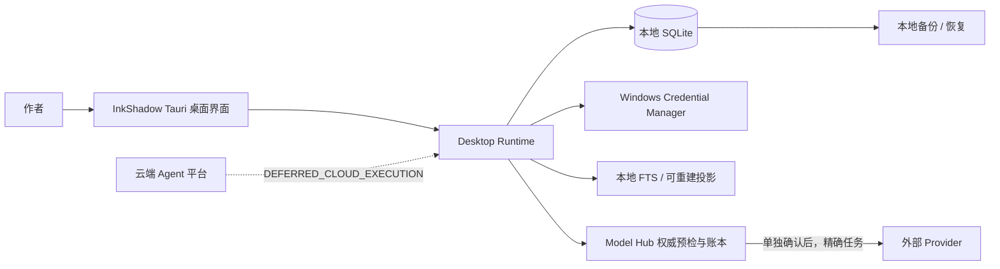

当前产品没有“云端执行更完整、桌面只展示结果”的生产路径。正文、不可变版本、Candidate、
StoryFact、任务、调用账本和调查状态均以本地权威为准；凭据值只在系统凭据库中保存。进入
Model Hub 配置过模型不等于同意发送正文，任何允许的模型派发仍要绑定精确任务与单独确认。

## 2. 本地 Tauri 容器与权威数据

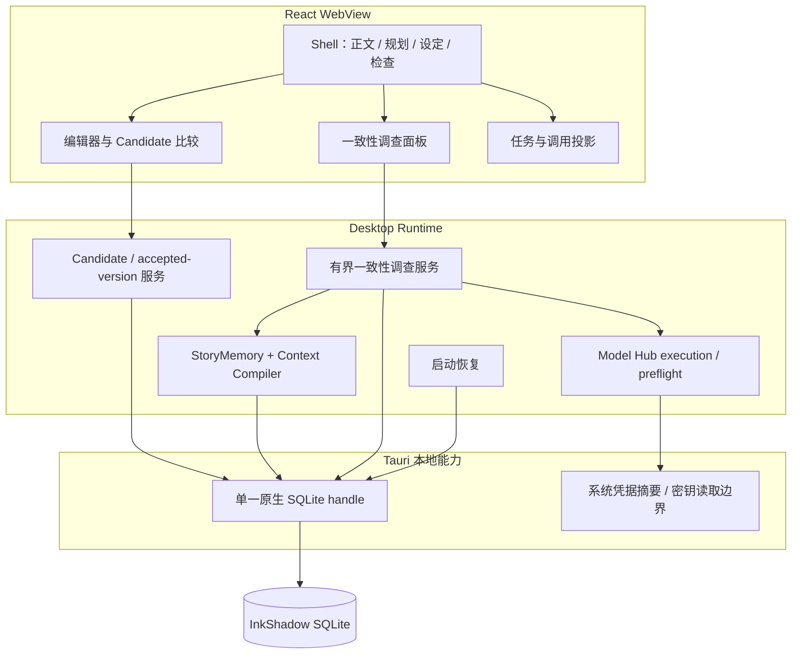

SQLite reload 复用同一个原生 handle，renderer session token 只用于拒绝旧会话并回滚孤立事务；
它不会另开空库。Data `0066` / Tauri `69` 保存写作模式、本地整理授权和内容无关披露 grant；
Data `0067` / Tauri `70` 保存有界调查 run、step、finding 与 evidence；Data `0068` / Tauri
`71` 修正 active grant 上限；Data `0069` / Tauri `72` 追加 content-free planned invocation UUID，
封闭账本启动与 Agent 回调之间的崩溃窗口；Data `0070` / Tauri `73` 为可重建搜索投影追加多粒度、
父子 UTF-16 定位与 current/branch/POV/story-time/authority/privacy 范围。当前原生序列是 70 个 Data + 3 个
story-core，即 Tauri internal `73`。启动恢复会依据 Provider 发送边界结清 running ledger/run，并把 terminal run
对应的非终态 task 对账为 succeeded/cancelled/failed；任何分支都不自动重发。偏好、grant 与四张
调查表共六张权威表已进入既有完整备份顺序，当前恢复断言为 172 张表；`planned_invocation_id`
随 investigation step 整表复制，凭据值仍不进入备份。

直接模式的一次性本地整理授权与 Provider 披露 grant 是两种独立权威：前者只保存
`direct_local_organization_authorized_at`，永不授权联网；后者精确绑定 task、Provider、model、
发送范围及其 hash、调用数、重试上限、费用状态与精确估算、币种和隐私策略。费用估算变化会生成
新 fingerprint，并在同一 SQLite 事务中只撤销同一授权族的旧 active grant；其他 Provider、模型或
范围的 active grant 不受影响。旧 terminal grant 保留为审计；若相同 fingerprint 后续重新授权，
会先归档到 `local_audit_events` 再替换。`0068` 允许 terminal 审计超过 128 条，但 active grant
仍最多 128 条，不把提高上限当作授权绕过。

## 3. 权威记忆、查询和检索

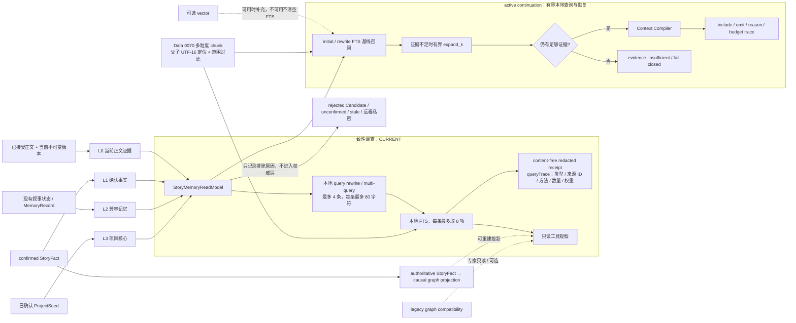

查询规划只做本地、确定性改写，不能构造 SQL，也不调用模型。当前上限为 4 条查询、每条 80
字符；fact、alias、time、location 和无输入时的 fallback 类型有固定权重。运行时工具观察可临时
携带查询文本用于本次检索与有界综合；生成持久 `observationDigest` 前会转换为 content-free
receipt，其中 `queryTrace` 只含 `sourceEntryId`、查询类型、`fts`、结果数和 fusion weight，
SQLite 最终保存该 receipt 的 digest，不保存 query、正文或 receipt 本体。

active continuation 与一致性调查都使用确定性的有界本地查询计划：`initial`、本地 `rewrite`、
证据不足时 `expand_k`，仍不足则返回 `evidence_insufficient`，不会远程检索、扩大隐私范围或隐式
派发 Provider。`rerankWithLocalEvidence` 是可选纯本地评分器，按查询覆盖、短语、原召回分数和
治理信号排序，并要求每个候选带 source/version/locator/SHA-256；固定六臂对照已经覆盖该方法，
但产品默认仍保留简单 FTS，不把对照自动变成所有任务的 rerank/GraphRAG 路由。

### 3.1 续写请求时序

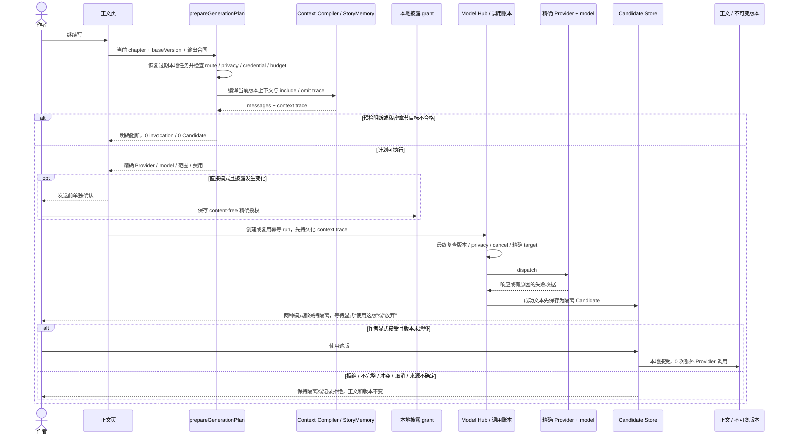

该图描述的是当前续写主链，不把“本地整理授权”解释为正文自动接受或后台派生授权。直接模式把生成执行的网络重试上限
压为 0，但与专业模式一样要求作者明确接受 Candidate；接受与后续 delta 本地设定整理均为 0 次 Provider 调用。专业模式既有的同模型
reasoning-only 截断恢复不是模型 fallback，也不能据此宣称已经具备增量 Prompt 要求的多
invocation fallback 收据。

## 4. 检索评估的当前证据

`evaluateRetrievalRanking` 已提供纯函数指标：`Recall@K`、`Precision@K`、MRR、nDCG、hit rate、
authority precision、stale hit rate、rejected Candidate contamination rate 和 private leakage
count。输入只有稳定 ID 与集合标签，不需要正文，也不调用网络或模型。

当前固定六臂本地矩阵比较 `fts_baseline`、`fts_vector`、`fts_vector_local_rerank`、
`fts_vector_graph_local_rerank`、`weighted_fusion` 与 `rrf_grouped_fusion`，保留逐样本原始指标且
0 dispatch / 0 network。对照已完成，但当前产品默认仍采用简单 FTS；不会因 fixture 自动打开
vector、graph 或 rerank。此外已接线 production-path runner：使用真实临时 SQLite、当前 `0070`
FTS/StoryMemory/一致性调查 consumer，覆盖 5k/20k/50k/200k 和不少于 30 个语义样本。
该 runner 拒绝 `WORKTREE_UNBOUND`，必须由 `INKSHADOW_SOURCE_REVISION` 绑定冻结的 40 位 commit。因此在唯一提交上实际运行并
保存原始 JSON/汇总前，只能记 `FINAL_BENCHMARK_PENDING`，不得把 fixture 数字填成 production 结论。

## 5. 一致性调查状态机

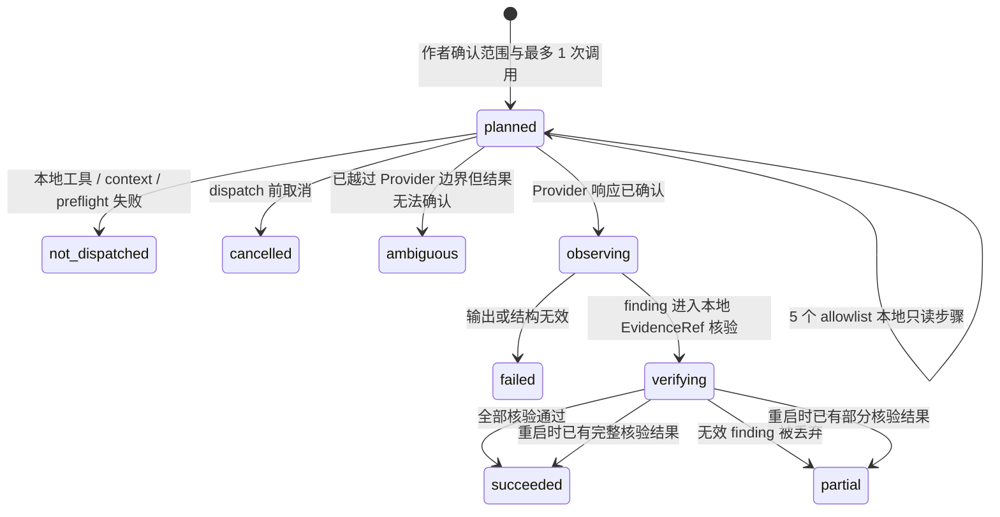

该策略硬编码 `maximumModelCalls = 1`、`maximumToolSteps = 5`、`automaticRetryCount = 0`。
5 个工具依次为 `read_story_memory`、`inspect_fact`、`search_fts`、`inspect_causal`、
`validate_evidence`，全部是本地只读；之后最多一次 `model_synthesis`，最后本地
`verify_findings`。启动恢复把未越过 Provider 边界的任务终结为 `not_dispatched`，越过边界而
无法确认的任务终结为 `ambiguous`，两者都不自动重发。

`bound` 是模型 step 状态，不是 run 状态：Agent 先持久化 planned invocation UUID，再把同一 ID
交给 Model Hub；账本 INSERT 会原子绑定 step 与 context trace。调用账本的
`provider_dispatch_started_at` 才是网络边界事实。响应确认后该 step 进入 `succeeded`；
若重启时未见边界事实则从 reserved/bound 结清为 `not_dispatched`，已见边界但没有确认响应则结清
为 `ambiguous`。因此界面不能仅凭“已绑定”或 task running 推断已经调用 Provider。
调查与 repair Candidate 是两项独立授权。两者各自把完整 Model Hub inspection authority、全部
capability evidence、connection display、隐私、context/messages 绑定进 fingerprint，并在确认后与
最终 dispatch 前重读；route、价格、目的地、能力、正文或 EvidenceRef 任一漂移都保持 0 Provider。
当前聚焦回归为 2 files / 36 tests PASS；真实 Provider/Tauri 仍未跑。

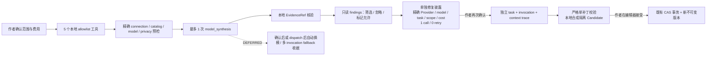

### 5.1 当前 Tool Calling 时序

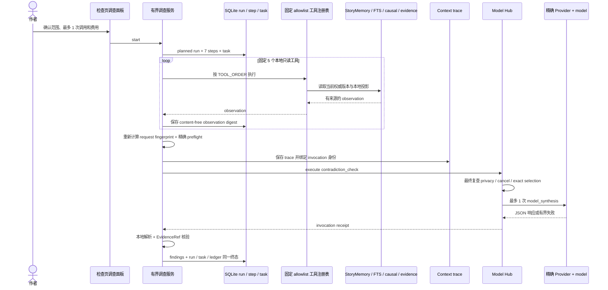

这里的 “Tool Calling” 是应用按固定 `TOOL_ORDER` 执行 5 个本地只读工具；当前模型不能选择工具、
改写顺序或注册任意函数。Observation 只影响最后一次有界综合的输入，不会触发自适应 replan。

### 5.2 发送前 fallback 决策

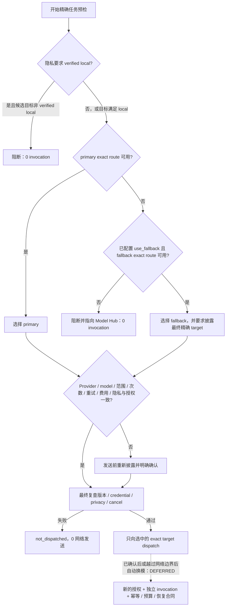

当前 fallback 只发生在发送前的 route resolution，并且最终 target 必须重新进入披露与预检。它不是
“primary 请求失败后自动尝试 fallback”。dispatch 后换模、自动重发和把多次网络请求合并成一个
invocation receipt 都是 `DEFERRED`。

### 5.3 错误与重启恢复决策树

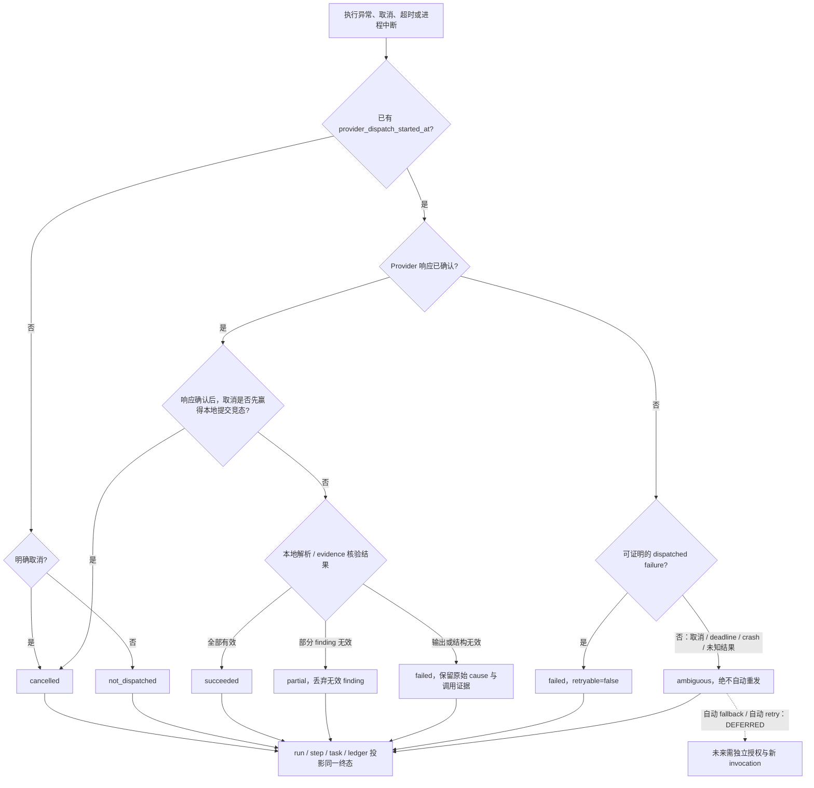

启动恢复读取相同网络边界事实，不根据 UI 是否还显示 running 猜测状态。发送前的 reserved / bound
孤立步骤收口为 `not_dispatched`，对应 running invocation 收口为 `cancelled`；越过边界但没有确认
响应的步骤收口为 `ambiguous`，账本收口为带 `PROVIDER_RESULT_AMBIGUOUS` 的 `timed_out`。随后以
终态 run 对账尚未终结的 task；两类都不会在重启时自动调用 Provider。

发送前，`executeModelHubTextTask` 可以按已配置 route 的 `use_fallback` 选择实际 fallback；确认页与
账本必须披露并绑定最终选中的精确 Provider/model。该选择仍只有 1 个 invocation、0 网络重试。
响应确认后或越过 dispatch 边界后没有自动换模、自动 fallback 或自动重发；结果未知进入
`ambiguous`。未来若增加多次尝试，每次都必须是独立 invocation，且先完成新的授权、预算、幂等
和恢复合同，不能把多次网络请求藏在一次“调查”收据里。

## 6. Candidate、版本与派生恢复

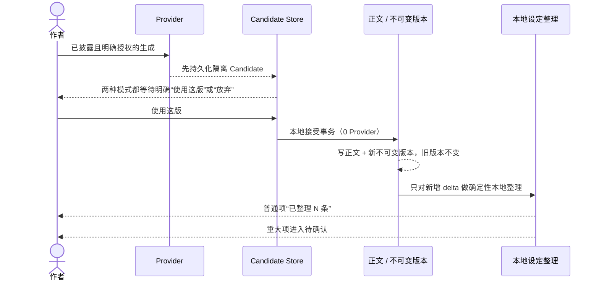

直接模式只简化界面和之后的本地整理，不跳过 Candidate、作者明确接受、不可变版本或冲突检查。Candidate
接受、拒绝、版本恢复、本地普通设定整理和重大项待确认都不会授权新的 Provider 调用。派生失败
不回滚已接受正文；私密章节在任何远程 dispatch 前 fail closed。“从 finding 生成修复
Candidate”已经作为调查之外的独立授权动作接线：准备阶段 0 call，作者选择当前证据章节并查看
精确 Provider/model/task/范围/费用/隐私后再次确认，随后只允许一个独立 invocation、0 retry。
finding EvidenceRef 进入 Context Compiler trace，严格结构只允许一个连续补丁，本地合成完整章节
Candidate 并通过既有原子 output commit 关联 trace；任何失败、取消、ambiguous、重启或版本漂移
都不自动重发、不创建 Candidate、不改正文。接受继续走原有 Candidate CAS 与不可变版本事务。
独立修复 task 的既有 metadata 只持久化 invocation/trace/目标版本/请求指纹等 content-free 恢复
权威。启动时 planned、bound、dispatched 与 Provider 已成功但 Candidate 尚未提交的窗口分别结清，
只终止、不重建 prompt、不调用 Provider；发送后的 native cancel 也按 ambiguous 处理，迟到文本不会
创建 Candidate。当前修复 loadout 只使用经 EvidenceRef 精确匹配的 L0/L1 当前权威证据；FTS/causal
计数或摘要收据在 scoped EvidenceRef 接线完成前不能进入修复上下文。

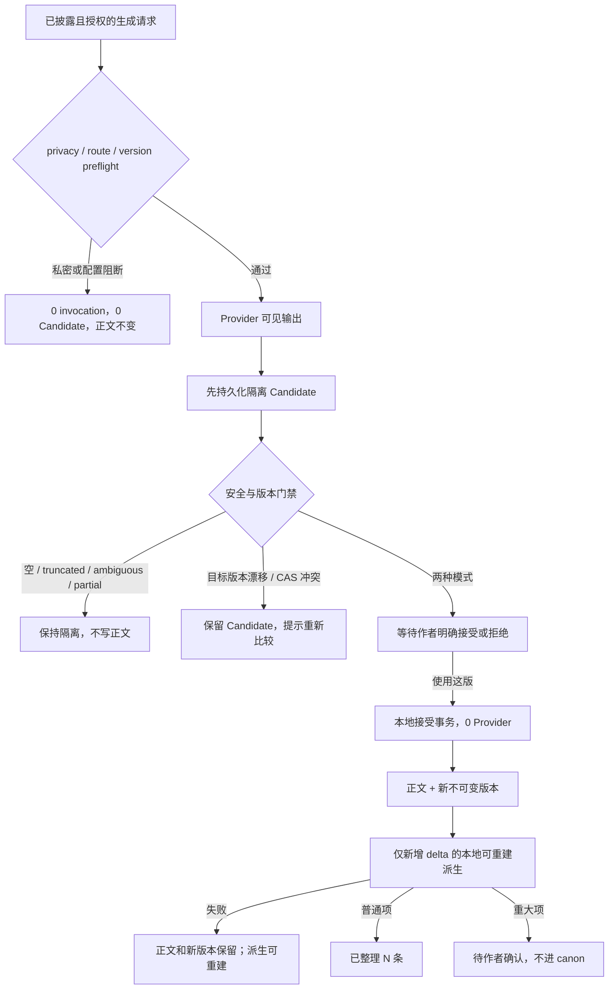

## 7. 为什么增量要求不能被错误合并

| 结论                          | 原因                                                                               |
| ----------------------------- | ---------------------------------------------------------------------------------- |
| Embedding 不能负责正文生成    | Embedding 只把输入映射为检索表示，不产生可验收章节文本。                           |
| 生成模型不能替代索引          | 每次把全书交给生成模型既不稳定也不可追踪；本地索引负责可重复召回与遗漏说明。       |
| reranker 必须在 recall 之后   | 没有候选集就没有可排序对象；rerank 只能改善排序，不能补回根本未召回的证据。        |
| 微调不能替代动态 StoryMemory  | 微调权重不是作品当前版本数据库，无法可靠反映作者刚接受、恢复或否决的事实。         |
| Agent 需要外部权威记忆        | 模型上下文有限且会过期；每一步都要从当前版本与确认事实重新取证。                   |
| Memory 不等于聊天记录         | 聊天内容可能是建议、错误或已否决草稿；权威记忆必须有来源、版本、状态与隐私。       |
| GraphRAG 只能是可重建投影     | 图丢失或构建失败不能回滚正文；canon 仍在 accepted version 与 confirmed StoryFact。 |
| StoryFact 是设定 canon        | 普通本地提取也必须保留证据；重大项未经确认不得成为 StoryFact canon。               |
| context 缺失不能静默 fallback | 只有发送前已配置 route 的 `use_fallback` 可选模；不得用换来源掩盖缺失上下文。      |
| ambiguous 不能自动重试        | 网络边界后无法确认是否已计费；自动重发可能重复调用和产生冲突结果。                 |
| 简单任务不强制多 Agent        | 多 Agent 会增加调用、延迟和状态复杂度；当前固定单次综合已足够表达安全边界。        |
| 直接模式仍需要 Candidate/版本 | 直接模式改变交互默认，不改变 AI 结果隔离、可撤销性和不可变审计。                   |

## 8. 完成度与延期项

| 能力                                           | 当前状态                           | 不得外推的边界                                                                                                                                                                                                                                  |
| ---------------------------------------------- | ---------------------------------- | ----------------------------------------------------------------------------------------------------------------------------------------------------------------------------------------------------------------------------------------------- |
| 有界本地 query rewrite / multi-query（4 × 80） | `CURRENT_IMPLEMENTED_NOT_RETESTED` | 聚焦 1 file / 4 tests PASS；不是模型改写，也不是任意 SQL。                                                                                                                                                                                      |
| content-free `queryTrace`                      | `CURRENT_IMPLEMENTED_NOT_RETESTED` | 本次内存观察可含查询文本；持久层只存 redacted receipt 的 digest。                                                                                                                                                                               |
| 离线检索指标与固定六臂矩阵                     | `CURRENT_IMPLEMENTED_NOT_RETESTED` | 六臂确定性对照已完成且 0 dispatch；不是冻结 production benchmark 或真实长篇质量结论。                                                                                                                                                           |
| FTS 基线与可选 local rerank                    | `CURRENT_IMPLEMENTED_NOT_RETESTED` | 默认仍为简单 FTS；vector/graph/rerank 不自动启用，冻结 production consumer 全链仍待复跑。                                                                                                                                                       |
| continuation / investigation query recovery    | `CURRENT_IMPLEMENTED_NOT_RETESTED` | `initial → rewrite → expand_k → evidence_insufficient` 已接线；证据不足不远程派发或扩大范围。                                                                                                                                                   |
| StoryFact→Graph / Narrative / TaskGraph        | `CURRENT_IMPLEMENTED_NOT_RETESTED` | 三条投影已实现并复用当前权威；冻结后的 restart/restore/consumer 全链仍待复跑。                                                                                                                                                                  |
| 直接模式一次性本地整理授权                     | `CURRENT_IMPLEMENTED_NOT_RETESTED` | 与 Provider 权威分离；只保存本地时间戳，0 次联网授权。                                                                                                                                                                                          |
| 披露 grant 轮换（Data 0068 / Tauri 71）        | `CURRENT_IMPLEMENTED_NOT_RETESTED` | 同一授权族事务轮换；只限制 128 条 active，terminal 保留审计。                                                                                                                                                                                   |
| 调查 invocation 预留（Data 0069 / Tauri 72）   | `CURRENT_IMPLEMENTED_NOT_RETESTED` | content-free ID 原子绑定、ledger/run 结清与 task 对账已实现；最终门禁待复跑。                                                                                                                                                                   |
| 多粒度范围化 FTS（Data 0070 / Tauri 73）       | `CURRENT_IMPLEMENTED_NOT_RETESTED` | 当前 Data 70 files / 432、Search Core 3/34 PASS；六类 chunk、父子 UTF-16 定位与 current/branch/POV/story-time/authority/privacy 过滤已覆盖，冻结候选仍须重跑。                                                                                  |
| Production Agent 调查                          | `CURRENT_IMPLEMENTED_NOT_RETESTED` | 固定 5 工具、1 call、0 retry；调查/修复各自披露和双重 fingerprint 重检已 2 files/36 PASS，通用自适应 Agent 不在当前范围。                                                                                                                       |
| 自适应 Observation → Replan                    | `NOT_IMPLEMENTED`                  | 当前工具顺序固定。                                                                                                                                                                                                                              |
| 确认后/dispatch 后自动 fallback                | `DEFERRED`                         | 仅保留发送前已配置 route 的降级选择；仍为 1 invocation/0 retry。                                                                                                                                                                                |
| 多 invocation fallback receipts                | `DEFERRED`                         | 当前一个 run 最多一个模型 invocation。                                                                                                                                                                                                          |
| 多粒度 chunk / 父子引用                        | `CURRENT_IMPLEMENTED_NOT_RETESTED` | Data 0070 与生产 FTS 范围已接线；当前 Data 70 files / 432、Search Core 3/34 PASS，冻结候选仍须重跑。                                                                                                                                            |
| 完整检索 benchmark / 消融 / 延迟基线           | `FINAL_BENCHMARK_PENDING`          | 5k/20k/50k/200k、≥30 样本 runner 已接线；必须在唯一冻结 commit 上保存原始结果后才可更新。                                                                                                                                                       |
| 云端 Agent 执行                                | `DEFERRED_CLOUD_EXECUTION`         | 当前没有云端生产执行平面。                                                                                                                                                                                                                      |
| 从 finding 生成修复 Candidate                  | `CURRENT_IMPLEMENTED_NOT_RETESTED` | 独立披露与 1 call/0 retry；EvidenceRef trace、Candidate 隔离、取消/重启不重发已覆盖；真实 Provider/Tauri 待测。                                                                                                                                 |
| Provider 发送前精确披露                        | `CURRENT_IMPLEMENTED_NOT_RETESTED` | 续写 31/31、opening 2 files/79、Settings 3 files/69 + 55/55、图片/编辑器 3 files/46、调查/修复 2 files/36、旧导入决定链 5/5 已通过；固定 probe 冻结/重检与豆包有效模型统一已关闭 scoped P1。冻结全量仍待，真实 Provider 为 `BLOCKED_EXTERNAL`。 |
| 四格式图片嵌入与原生保存回执                   | `CURRENT_IMPLEMENTED_NOT_RETESTED` | 内部产物解析、安全图片上限、原生票据和写后 size+SHA 已覆盖；外部应用打开与真实 Tauri 对话框仍 `BLOCKED_EXTERNAL`。                                                                                                                              |
| 本增量包预算                                   | `UNCHANGED_PENDING_FINAL_BUILD`    | 当前沿用 7 MiB 与既有单文件上限；若冻结 source graph 证明需要，只允许带精确增量、理由、余量与单文件守卫的有界调整，不得无节制放宽。                                                                                                             |

## 9. 代码对应关系

| 架构节点                              | 当前实现                                                                                                                                                                                                                                                                                                                                                                                                                                                                                                                                                                                                                                                                                                                                                                                                                                                                                                   |
| ------------------------------------- | ---------------------------------------------------------------------------------------------------------------------------------------------------------------------------------------------------------------------------------------------------------------------------------------------------------------------------------------------------------------------------------------------------------------------------------------------------------------------------------------------------------------------------------------------------------------------------------------------------------------------------------------------------------------------------------------------------------------------------------------------------------------------------------------------------------------------------------------------------------------------------------------------------------- |
| StoryMemory / Narrative / EvidenceRef | [`../../packages/ai-core/src/story-memory-read-model.ts`](../../packages/ai-core/src/story-memory-read-model.ts)、[`../../apps/desktop/src/infrastructure/story-memory-read-model.ts`](../../apps/desktop/src/infrastructure/story-memory-read-model.ts)、[`../../apps/desktop/src/infrastructure/narrative-state-read-model.ts`](../../apps/desktop/src/infrastructure/narrative-state-read-model.ts)                                                                                                                                                                                                                                                                                                                                                                                                                                                                                                     |
| StoryFact → authoritative graph       | [`../../packages/application/src/use-cases/authoritative-story-graph-projection.ts`](../../packages/application/src/use-cases/authoritative-story-graph-projection.ts)、[`../../apps/desktop/src/infrastructure/story-graph-runtime.ts`](../../apps/desktop/src/infrastructure/story-graph-runtime.ts)                                                                                                                                                                                                                                                                                                                                                                                                                                                                                                                                                                                                     |
| 本地查询规划 / content-free trace     | [`../../apps/desktop/src/infrastructure/consistency-investigation-query-plan.ts`](../../apps/desktop/src/infrastructure/consistency-investigation-query-plan.ts)、[`../../apps/desktop/src/infrastructure/consistency-investigation-tool-registry.ts`](../../apps/desktop/src/infrastructure/consistency-investigation-tool-registry.ts)                                                                                                                                                                                                                                                                                                                                                                                                                                                                                                                                                                   |
| local rerank / 离线指标               | [`../../packages/ai-core/src/evidence-rerank.ts`](../../packages/ai-core/src/evidence-rerank.ts)、[`../../packages/ai-core/src/retrieval-evaluation.ts`](../../packages/ai-core/src/retrieval-evaluation.ts)                                                                                                                                                                                                                                                                                                                                                                                                                                                                                                                                                                                                                                                                                               |
| Query recovery / execution policy     | [`../../apps/desktop/src/infrastructure/bounded-local-retrieval-query-plan.ts`](../../apps/desktop/src/infrastructure/bounded-local-retrieval-query-plan.ts)、[`../../apps/desktop/src/infrastructure/model-execution-policy.ts`](../../apps/desktop/src/infrastructure/model-execution-policy.ts)                                                                                                                                                                                                                                                                                                                                                                                                                                                                                                                                                                                                         |
| Agent 状态、派发与恢复                | [`../../apps/desktop/src/infrastructure/consistency-investigation-service.ts`](../../apps/desktop/src/infrastructure/consistency-investigation-service.ts)、[`../../apps/desktop/src/infrastructure/consistency-investigation-store.ts`](../../apps/desktop/src/infrastructure/consistency-investigation-store.ts)、[`../../apps/desktop/src/infrastructure/consistency-investigation-recovery.ts`](../../apps/desktop/src/infrastructure/consistency-investigation-recovery.ts)                                                                                                                                                                                                                                                                                                                                                                                                                           |
| TaskGraph                             | [`../../apps/desktop/src/infrastructure/consistency-investigation-task-graph.ts`](../../apps/desktop/src/infrastructure/consistency-investigation-task-graph.ts)                                                                                                                                                                                                                                                                                                                                                                                                                                                                                                                                                                                                                                                                                                                                           |
| finding 修复 Candidate                | [`../../apps/desktop/src/infrastructure/consistency-repair-candidate-service.ts`](../../apps/desktop/src/infrastructure/consistency-repair-candidate-service.ts)、[`../../apps/desktop/src/components/consistency-investigation-panel.tsx`](../../apps/desktop/src/components/consistency-investigation-panel.tsx)、既有 context trace output commit 与 Candidate 接受事务                                                                                                                                                                                                                                                                                                                                                                                                                                                                                                                                 |
| 多粒度 FTS / production benchmark     | [`../../packages/data/migrations/0070_multigranular_search_retrieval.sql`](../../packages/data/migrations/0070_multigranular_search_retrieval.sql)、[`../../apps/desktop/src/infrastructure/production-long-form-benchmark.test.ts`](../../apps/desktop/src/infrastructure/production-long-form-benchmark.test.ts)、[`../../scripts/run-production-long-form-benchmark.mjs`](../../scripts/run-production-long-form-benchmark.mjs)                                                                                                                                                                                                                                                                                                                                                                                                                                                                         |
| Provider 披露                         | [`../../apps/desktop/src/infrastructure/provider-action-disclosure.ts`](../../apps/desktop/src/infrastructure/provider-action-disclosure.ts)、[`../../apps/desktop/src/infrastructure/continuation-generation-disclosure.ts`](../../apps/desktop/src/infrastructure/continuation-generation-disclosure.ts)、各生产动作的 prepare/confirm/fingerprint 链                                                                                                                                                                                                                                                                                                                                                                                                                                                                                                                                                    |
| 图片导出 / 保存回执                   | [`../../packages/import-export/src/publication-images.ts`](../../packages/import-export/src/publication-images.ts)、[`../../apps/desktop/src/infrastructure/export-artifact-download.ts`](../../apps/desktop/src/infrastructure/export-artifact-download.ts)、[`../../apps/desktop/src-tauri/src/native_export_artifact.rs`](../../apps/desktop/src-tauri/src/native_export_artifact.rs)                                                                                                                                                                                                                                                                                                                                                                                                                                                                                                                   |
| 数据迁移与备份                        | [`../../packages/data/migrations/0066_writing_experience_preferences.sql`](../../packages/data/migrations/0066_writing_experience_preferences.sql)、[`../../packages/data/migrations/0067_consistency_investigation_agent.sql`](../../packages/data/migrations/0067_consistency_investigation_agent.sql)、[`../../packages/data/migrations/0068_writing_disclosure_active_grant_limit.sql`](../../packages/data/migrations/0068_writing_disclosure_active_grant_limit.sql)、[`../../packages/data/migrations/0069_consistency_investigation_invocation_reservation.sql`](../../packages/data/migrations/0069_consistency_investigation_invocation_reservation.sql)、[`../../packages/data/migrations/0070_multigranular_search_retrieval.sql`](../../packages/data/migrations/0070_multigranular_search_retrieval.sql)、[`../../packages/data/src/maintenance.ts`](../../packages/data/src/maintenance.ts) |
| Candidate / 写作体验                  | [`../../apps/desktop/src/pages/editor-page.tsx`](../../apps/desktop/src/pages/editor-page.tsx)、[`../../apps/desktop/src/infrastructure/direct-story-fact-organizer.ts`](../../apps/desktop/src/infrastructure/direct-story-fact-organizer.ts)、[`../../apps/desktop/src/infrastructure/direct-writing-disclosure.ts`](../../apps/desktop/src/infrastructure/direct-writing-disclosure.ts)、[`../../apps/desktop/src/infrastructure/writing-experience-store.ts`](../../apps/desktop/src/infrastructure/writing-experience-store.ts)                                                                                                                                                                                                                                                                                                                                                                       |

生产 build 的最终文件名和精确字节仍为 `FINAL_BUILD_PENDING`；工作树在最后一次 build 后又有小幅
变化，不能抄用旧 `dist`。当前静态视觉证据已生成 32 条 manifest、32 个不同 SHA-256 的 PNG，
运行时明确是 `static_web_distribution` / Chromium，`tauriWebView=not_run`、
`systemScale=not_measured`。真实 Tauri 与 Windows 系统 DPI 仍须按第二阶段 Prompt 复测。
